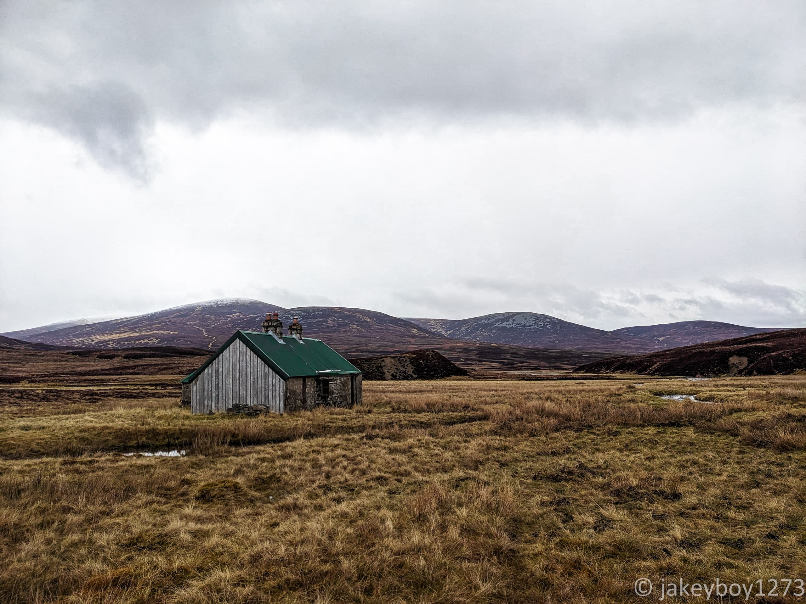

This is the tale of my third installment of wild Scottish solo hiking. Last year, I read a wonderful book called [Lonely Hills & Wilderness Trails](https://archive.org/details/lonelyhillswilde0000gilb) in which the author, Richard Gilbert, describes a 4-day hike he did with his wife traversing the majority of the Cairngorms from North to South. I dutifully plotted the route as per his description, before sprinkling in some extras to keep things interesting, and then set off in the trusty Yaris in the wee hours of Good Friday!

### Day 1: Blair Atholl to Tarf Hotel

The drive up north was nice but some inclement weather en route gave me some jitters. I also noticed a healthy covering of snow still present on the tops of the hills, which made me wonder if I should have packed my microspikes. The plan was to cross the western ridge flanking the Lairig Ghru, but if the conditions were not favourable then the infamous valley itself was plan B. I parked up in the Old Bridge of Tilt car park, in a lovely little forest which served as the perfect start to get back into the swing of things.

For five blissful hours I rambled through Glen Tilt, following the River Tilt northwards on a very gentle incline. It was a crisp, sunny morning with plenty of opportunities to stop and rest by burns, waterfalls, and groups of sheep. This part of the walk was quite busy, and I wondered if I would miss the thrill of the sheer isolation during last year's Cape Wrath Trail section hike. I did enjoy chatting to the people I met, though; a group of lads bagging a Corbett, a fellow solo traveller [fastpacking](https://en.wikipedia.org/wiki/Fastpacking) a similar route to me but at twice the speed, and an old man with a dog named Rose.

The path eventually forks, with the main route continuing through the glen, and an alternative scrappy-looking branch leading up over a ridge. This was the path leading to the [Tarf Hotel](https://www.mountainbothies.org.uk/bothies/eastern-highlands/tarf-hotel-feith-uaine/) - my final destination for the day. It was a bit of a detour (1 hour each way) but I do love bothies, and the promise of a guaranteed dry night to start the expedition off with was too good to pass up. The path was a bit brutal with a cheeky steep incline of 300m, but I broke it up by stopping for lunch near the top. On the menu was chicken super noodles, with some new camping technology I had procured called "coconut oil". This substance, novel to science and mankind, has an insanely high calorie:gram ratio, and also makes everything taste delicious - what a hack!

After summiting Mount Tilt, I descended into the neighbouring glen carved out by the Tarf river. The map showed the presence of a ford which could be crossed to get over to the same side of the river as the bothy, but upon inspection it seemed very capable of washing me away, so I consulted the map and found that the river split away upstream, so I opted to walk along the boggy south bank until I found a narrower crossing point. This proved to be a challenge, and in the end my best bet still required me to toss my bag across followed by tossing myself across, but I made it! To my absolute delight, I had the whole place to myself.

The bothy was cosy enough, and I found some ancient Scottish relics such as a can of Erwin's lager (circa. 3000 BCE) and a ball of functioning fairy lights. I felt sufficiently remote, so I was very happy with myself. There appeared to be no discernable paths leading to the bothy, which made its large size seem quite strange. The last entry in the book was a month ago in March, and the one before that was January, so it didn't seem to get much traffic. I settled in for the evening and did some writing, then scranned my camping meal and a handful of Maryland Cookies (elite hiking snack - could potentially be dipped in coconut oil?). After such an early start and a long drive, I ended up going to bed shortly after dusk. It was a short hiking day, about 6:30 all in all, but I had a much longer day to follow so an early night and early start made a lot of sense.
